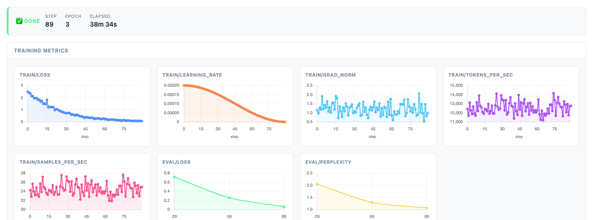
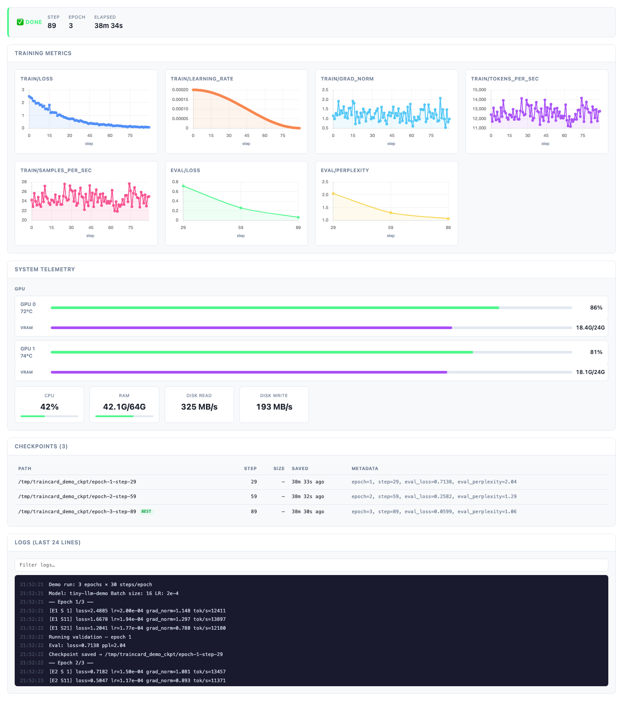

# metaflow-traincard

[](https://github.com/npow/metaflow-traincard/actions/workflows/ci.yml)
[](https://pypi.org/project/metaflow-traincard/)
[](LICENSE)
[](https://www.python.org/downloads/)

See your training run live — loss curves, GPU usage, and checkpoints — without leaving Metaflow.

## The problem

LLM fine-tuning jobs run for hours with zero visibility. By the time you know your loss is diverging or your GPU is idle, the run has been wasting compute for hours. TensorBoard requires a separate server; W&B requires credentials and an account — and neither result is versioned with the run itself.

## Quick start

```bash
pip install metaflow-traincard
```

```python
from metaflow import FlowSpec, step, card
from metaflow_traincard import Reporter

class MyFlow(FlowSpec):

    @card(type="traincard")
    @step
    def train(self):
        reporter = Reporter()

        for step_num, batch in enumerate(loader):
            loss = train_step(batch)
            reporter.metric("loss", loss, step_num)

        reporter.finish()
        self.traincard_state = reporter.get_state()
        self.next(self.end)
```

Open the card in the Metaflow UI — live loss curves, GPU bars, and checkpoint history are waiting.

## Install

```bash
# Core
pip install metaflow-traincard

# With HuggingFace Trainer integration
pip install "metaflow-traincard[hf]"
```

## Usage

### Raw PyTorch

```python
reporter = Reporter(
    output_dir="/tmp/traincard",  # where metrics are buffered
    flush_interval=5,             # seconds between background flushes
    rank=0,                       # distributed rank (non-zero ranks are silent)
    world_size=1,
)

reporter.metric("train/loss", loss, step=global_step)
reporter.metric("train/learning_rate", lr, step=global_step)
reporter.system({
    "gpu_utilization": [88.0, 83.0],
    "gpu_memory_used_gb": [18.5, 18.2],
    "gpu_memory_total_gb": [24.0, 24.0],
    "cpu_percent": 35.0,
    "ram_used_gb": 42.1,
    "ram_total_gb": 64.0,
})
reporter.checkpoint("/tmp/ckpt-100", metadata={"eval_loss": 1.38, "epoch": 2})
reporter.finish()

self.traincard_state = reporter.get_state()
```

### HuggingFace Trainer

```python
from metaflow_traincard import HFTrainCardCallback

trainer = Trainer(
    model=model,
    args=training_args,
    callbacks=[HFTrainCardCallback()],
)
trainer.train()
self.traincard_state = HFTrainCardCallback().reporter.get_state()
```

`HFTrainCardCallback` maps all Trainer events automatically — `on_log` → metrics, `on_save` → checkpoints, `on_evaluate` → eval phase, `on_train_end` → finish. GPU/CPU telemetry is sampled every 10 seconds via `pynvml` + `psutil` (both optional).

### Preview the card locally

```python
from metaflow import Flow, namespace
from metaflow_traincard import render_state

namespace(None)
state = Flow("MyFlow").latest_run["train"].task["traincard_state"].data
open("card.html", "w").write(render_state(state))
# open card.html
```

## How it works

The `Reporter` writes metrics and telemetry to a local `events.jsonl` log via a background thread, flushing an atomic `latest.json` snapshot every few seconds. On step completion, `get_state()` returns the full in-memory state dict, which is stored as the `traincard_state` artifact. The `TrainCard` renderer reads that artifact and produces a self-contained HTML page — Chart.js charts, GPU utilization bars, checkpoint table, and log viewer — served by Metaflow's card system.

Crash safety: `latest.json` is written via `tmp-then-rename`, and a SIGTERM handler flushes state before the process exits. Resume detection: if the same `output_dir` exists from a prior run, metric history is loaded and a visual discontinuity marker is inserted in each chart.

## Card sections

| Section | What it shows |
|---------|--------------|
| **Status header** | Phase badge (TRAINING / EVALUATING / SAVING / DONE), step, epoch, elapsed time |
| **Training Metrics** | Live Chart.js line charts — loss, eval loss, LR, grad norm, tokens/sec, any custom metric |
| **System Telemetry** | Per-GPU utilization bars, VRAM used/total, temperature, CPU %, RAM, disk throughput |
| **Checkpoints** | Table of saved checkpoints — step, size, age, metadata; BEST badge on lowest eval loss |
| **Logs** | Searchable tail of recent log lines; errors and warnings highlighted |
| **Failure Summary** | Exception type, message, traceback toggle, OOM warning (shown only on crash) |



<details>
<summary>Full card (system telemetry · checkpoints · logs)</summary>



</details>

## Development

```bash
git clone https://github.com/npow/metaflow-traincard
cd metaflow-traincard
pip install -e ".[dev]"
pytest tests/ -v
```

## License

[Apache 2.0](LICENSE)
